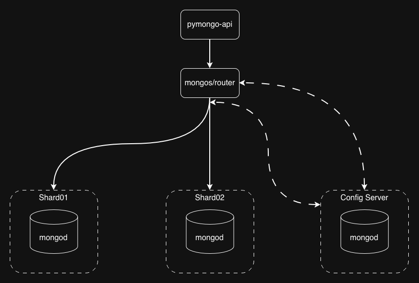
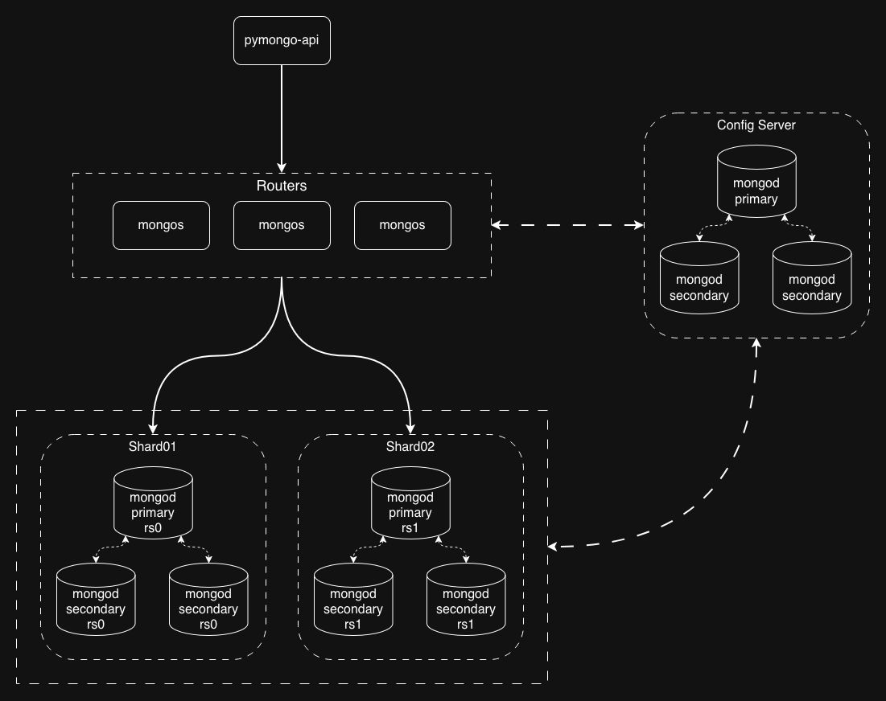
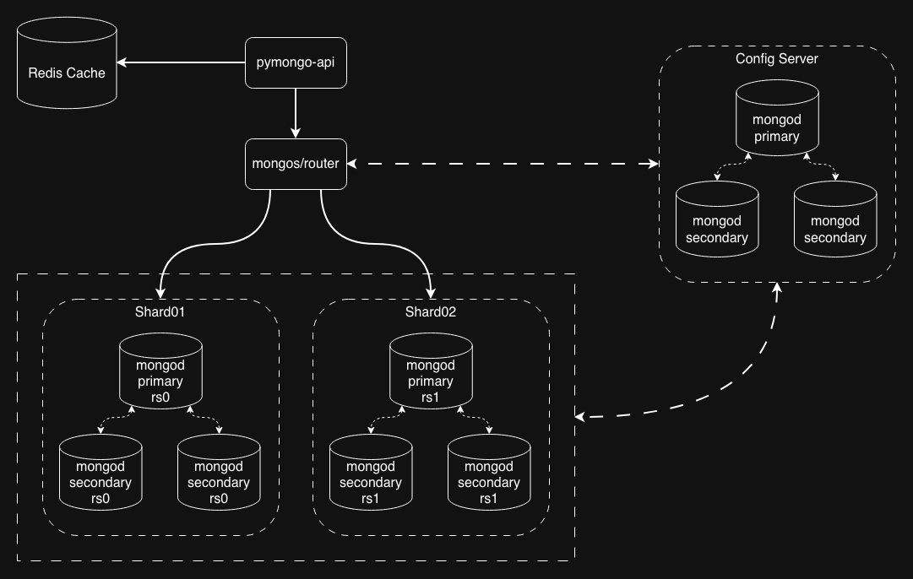

# Решение заданий

1. Подготовьте первый вариант схемы. Изобразите, как вы будете использовать шардирование в MongoDB, чтобы повысить производительность. Двух шардов будет достаточно
   1. [ссылка на исходник](task1-01.drawio)
   2. 
2. Составьте второй вариант схемы. Изобразите, как будет реализована репликация MongoDB для повышения отказоустойчивости. Чтобы это сделать, скопируйте первый вариант схемы и доработайте его, чтобы для каждого шарда была настроена репликация. На этом этапе у каждого шарда должно быть по три реплики. 
   1. [ссылка на исходник](task1-02.drawio)
   2. 
3. И наконец, на третьем варианте схемы изобразите вашу реализацию кеширования, чтобы повысить производительность ещё больше. Чтобы это сделать, скопируйте второй вариант схемы и добавьте инстанс Redis для кеширования запросов приложения к MongoDB 
   1. [ссылка на исходник](task1-03.drawio)
   2. 