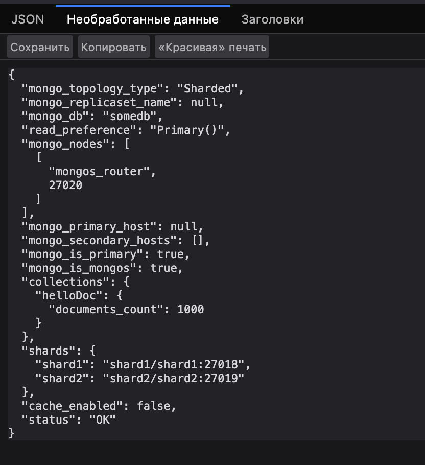

# [Инструкция по настройке и запуску](../mongo-sharding/README.md)

# Задание 2. Шардирование
1. Скопируйте исходную директорию с приложением и compose.yaml под новым именем mongo-sharding. 
2. В файле compose.yaml измените имя проекта на name: mongo-sharding. 
3. Модифицируйте compose.yaml таким образом, чтобы реализовать первый вариант схемы. За основу можете взять пример из урока про шардирование. 
4. В директории с проектом создайте файл README.md. Опишите там шаги для инициализации шардирования в MongoDB. 
5. Назовите БД somedb, а коллекцию — helloDoc.

Результат проверки по эндпоинту http://localhost:8080/:
