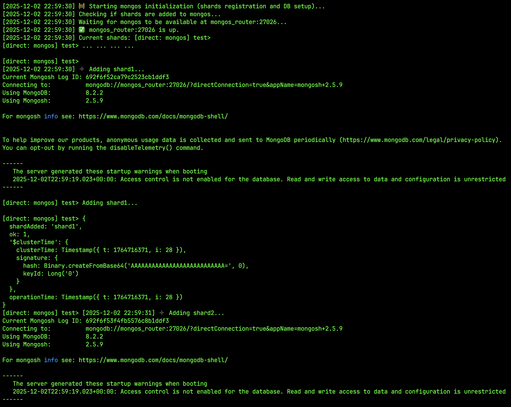
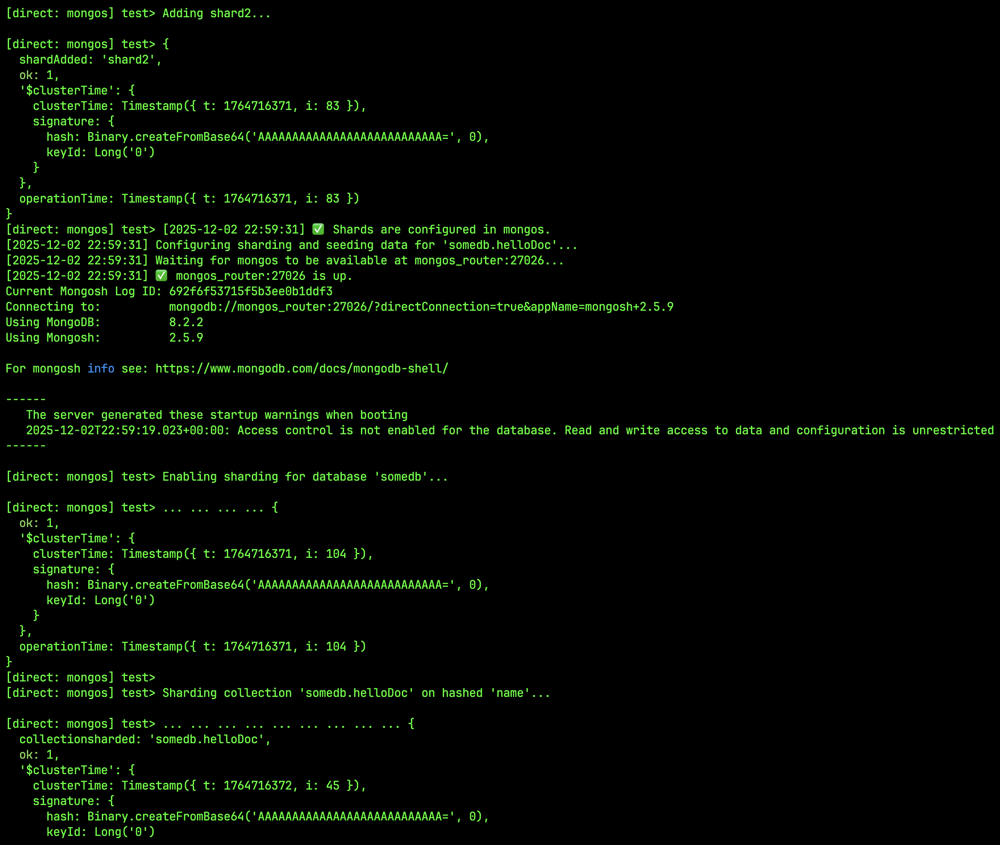
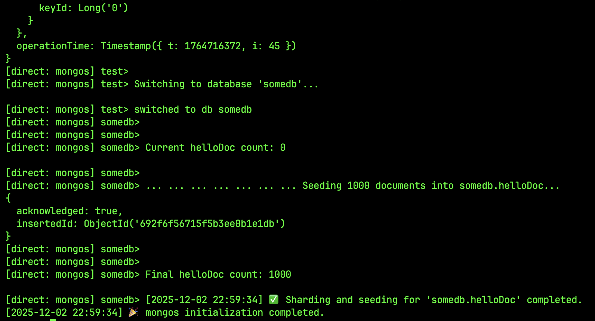

# Задание 3. Репликация
1. Скопируйте директорию с проектом mongo-sharding под новым именем mongo-sharding-repl. 
2. В файле compose.yaml измените имя проекта на name: mongo-sharding-repl. 
3. Модифицируйте compose.yaml таким образом, чтобы реализовать второй вариант схемы. За основу можете взять пример из урока про репликацию и кеширование. 
4. В директории с проектом создайте файл README.md. Опишите там шаги, которые нужно выполнить, чтобы настроить репликацию для каждого шарда в MongoDB.

# Примеры аутпута логов при успешном старте контейнеров:

## Запуск контейнеров

## configSrv

## shards

## mongos

