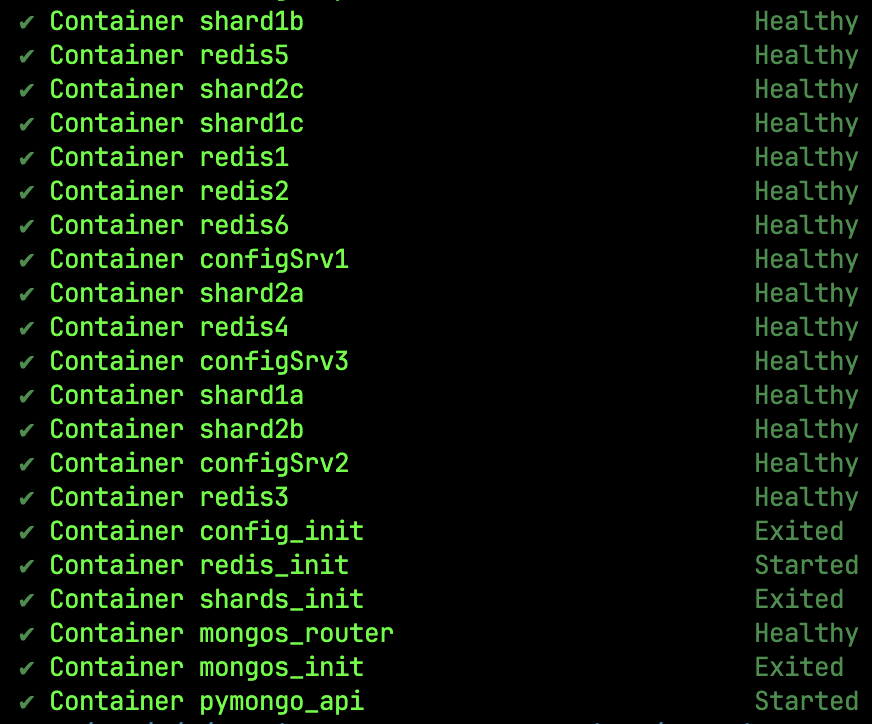
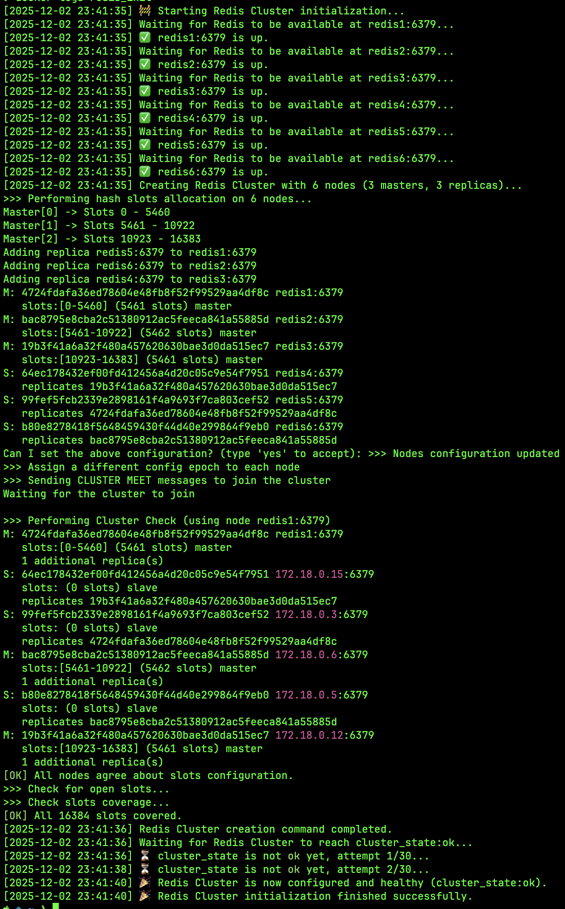
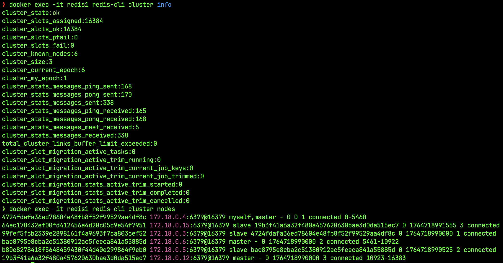

# Задание 4. Кеширование 
1. Скопируйте директорию с проектом mongo-sharding-repl под новым именем sharding-repl-cache. 
2. В файле compose.yaml измените имя проекта на name: sharding-repl-cache. 
3. Модифицируйте compose.yaml таким образом, чтобы реализовать второй вариант схемы. В качестве ориентира можете использовать пример из урока про кеширование. 
4. Чтобы включить кеширование в приложении, добавьте переменную окружения:
    ```
    REDIS_URL: "redis://<redis-service-name>:6379" 
    ```
    
    Вместо <redis-service-name> напишите имя сервиса redis.
    В приложении кеширование доступно для эндпоинта /<collection_name>/users. Проверьте скорость выполнения повторных запросов — она должна увеличиться.

# Примеры аутпута логов при успешном старте контейнеров:



